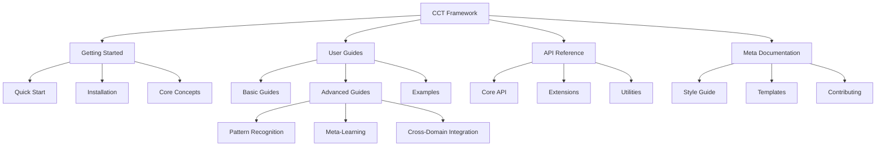

# CCT Framework Documentation

## Documentation Structure

## Quick Links

### Getting Started
- [Quick Start Guide](getting-started/quick-start.md)
- [Installation Guide](getting-started/installation.md)
- [Core Concepts](getting-started/core-concepts.md)

### User Guides
- [Basic Usage](user-guides/basic/README.md)
- [Advanced Topics](user-guides/advanced/README.md)
- [Examples](examples/README.md)

### Advanced Topics
- [Pattern Recognition](user-guides/advanced/pattern-recognition.md)
- [Meta-Learning Strategies](user-guides/advanced/meta-learning.md)
- [Cross-Domain Integration](user-guides/advanced/cross-domain-integration.md)

### Meta Documentation
- [Style Guide](meta/style-guide.md)
- [Documentation Template](meta/template.md)
- [Contributing Guide](meta/contribution-guide.md)

## Documentation Organization

### 1. Getting Started (`/docs/getting-started/`)
Essential information for new users:
- Installation and setup
- Basic concepts and terminology
- Quick start tutorials

### 2. User Guides (`/docs/user-guides/`)
Comprehensive guides for different skill levels:
- Basic usage patterns
- Advanced implementation techniques
- Best practices and optimization

### 3. Examples (`/docs/examples/`)
Practical implementations and use cases:
- Basic examples
- Advanced scenarios
- Integration patterns

### 4. API Reference (`/docs/api/`)
Detailed technical documentation:
- Core API documentation
- Extension interfaces
- Utility functions

### 5. Meta Documentation (`/docs/meta/`)
Documentation about documentation:
- Style guidelines
- Templates
- Contribution process

## Contributing

We welcome contributions to the documentation! Please see our [Contributing Guide](meta/contribution-guide.md) for details on:
- Documentation standards
- Submission process
- Review guidelines

## Version Information

This documentation corresponds to CCT Framework version 1.0.0. For other versions, please check the version selector above. 