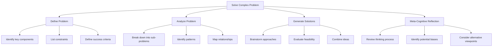

# Getting Started Example

This example demonstrates the basic functionality of the CCT Framework by creating a simple thought process for problem-solving.

## Prerequisites

- CCT Framework installed
- Basic Python knowledge
- Understanding of core concepts

## Example: Problem-Solving Process

```python
from cct_framework import CCTFramework, ThoughtNode, MetaCognitiveProcessor
from cct_framework.visualization import visualize_thought_process

def create_problem_solving_process():
    # Initialize the framework
    framework = CCTFramework()
    
    # Create a root thought process
    with framework.create_thought_process("Solve Complex Problem") as process:
        # Step 1: Problem Definition
        with process.create_sub_thought("Define Problem") as problem_def:
            problem_def.add_thought("Identify key components")
            problem_def.add_thought("List constraints")
            problem_def.add_thought("Define success criteria")
        
        # Step 2: Analysis
        with process.create_sub_thought("Analyze Problem") as analysis:
            analysis.add_thought("Break down into sub-problems")
            analysis.add_thought("Identify patterns")
            analysis.add_thought("Map relationships")
        
        # Step 3: Solution Generation
        with process.create_sub_thought("Generate Solutions") as solutions:
            solutions.add_thought("Brainstorm approaches")
            solutions.add_thought("Evaluate feasibility")
            solutions.add_thought("Combine ideas")
        
        # Step 4: Meta-Cognitive Reflection
        process.add_reflection("Review thinking process")
        process.add_reflection("Identify potential biases")
        process.add_reflection("Consider alternative viewpoints")
    
    return process

def analyze_thought_process(process):
    # Create a meta-cognitive processor
    processor = MetaCognitiveProcessor()
    
    # Analyze the thought pattern
    analysis = processor.analyze_thought_pattern(process)
    
    # Generate insights
    insights = processor.generate_insights(analysis)
    
    return insights

def main():
    # Create the thought process
    process = create_problem_solving_process()
    
    # Analyze the process
    insights = analyze_thought_process(process)
    
    # Visualize the thought process
    visualize_thought_process(process, filename="thought_process.svg")
    
    # Export the process to YAML
    process.export_to_yaml("thought_process.yaml")
    
    # Print insights
    print("\nMeta-Cognitive Insights:")
    for insight in insights:
        print(f"- {insight}")

if __name__ == "__main__":
    main()
```

## Example Output

### Thought Process Visualization

The visualization will show a hierarchical structure of thoughts:



### YAML Export

The thought process will be exported to a YAML file with this structure:

```yaml
thought_process:
  title: "Solve Complex Problem"
  steps:
    - name: "Define Problem"
      sub_thoughts:
        - "Identify key components"
        - "List constraints"
        - "Define success criteria"
    
    - name: "Analyze Problem"
      sub_thoughts:
        - "Break down into sub-problems"
        - "Identify patterns"
        - "Map relationships"
    
    - name: "Generate Solutions"
      sub_thoughts:
        - "Brainstorm approaches"
        - "Evaluate feasibility"
        - "Combine ideas"
    
    - name: "Meta-Cognitive Reflection"
      reflections:
        - "Review thinking process"
        - "Identify potential biases"
        - "Consider alternative viewpoints"
```

## Understanding the Code

### 1. Framework Initialization

```python
framework = CCTFramework()
```
Creates a new instance of the CCT Framework.

### 2. Thought Process Creation

```python
with framework.create_thought_process("Solve Complex Problem") as process:
```
Creates a new thought process with context management.

### 3. Adding Thoughts

```python
with process.create_sub_thought("Define Problem") as problem_def:
    problem_def.add_thought("Identify key components")
```
Creates hierarchical thought structures.

### 4. Meta-Cognitive Reflection

```python
process.add_reflection("Review thinking process")
```
Adds meta-cognitive reflections to analyze the thinking process.

### 5. Analysis and Visualization

```python
insights = analyze_thought_process(process)
visualize_thought_process(process, filename="thought_process.svg")
```
Analyzes the thought process and creates a visualization.

## Next Steps

1. Try modifying the example:
   - Add more sub-thoughts
   - Create different reflection patterns
   - Experiment with visualization options

2. Explore advanced features:
   - Custom meta-cognitive processors
   - Pattern recognition
   - Cross-domain mapping

3. Check out other examples:
   - [Pattern Recognition](../advanced-examples/pattern-recognition.md)
   - [Meta-Learning](../advanced-examples/meta-learning.md)
   - [Cross-Domain Integration](../advanced-examples/cross-domain-integration.md)

## Related Resources

- [Core Concepts](../../getting-started/core-concepts.md)
- [API Reference](../../api/overview.md)
- [Advanced Usage](../../user-guides/advanced/recursive-cct-framework.md) 