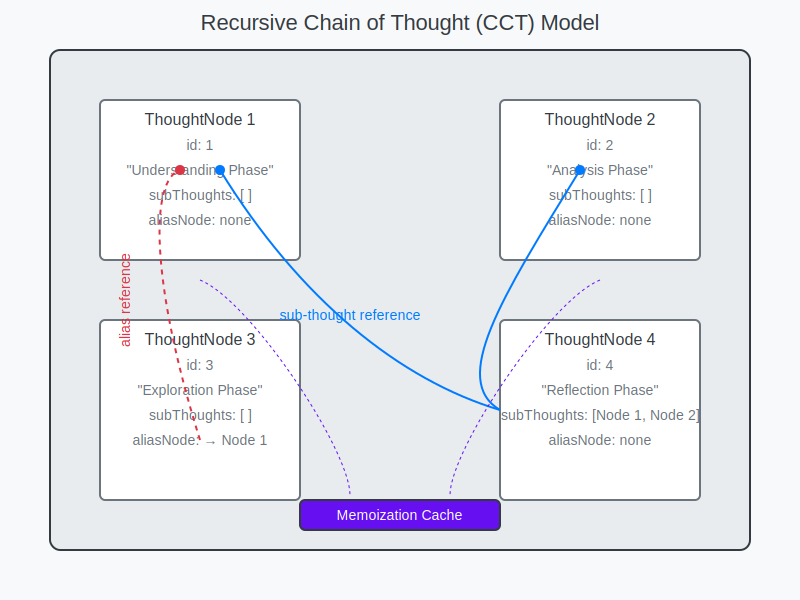
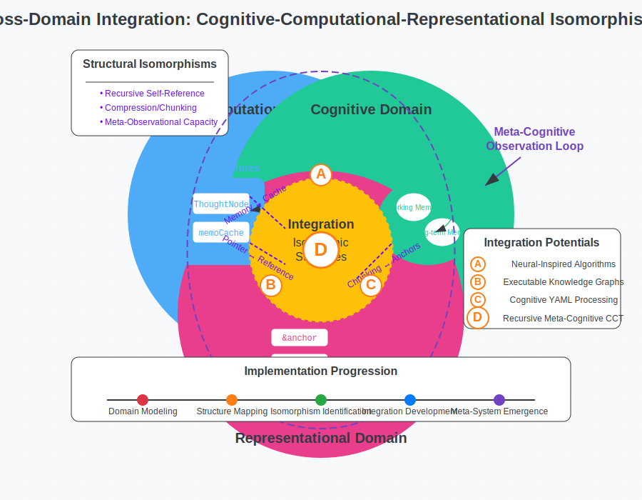
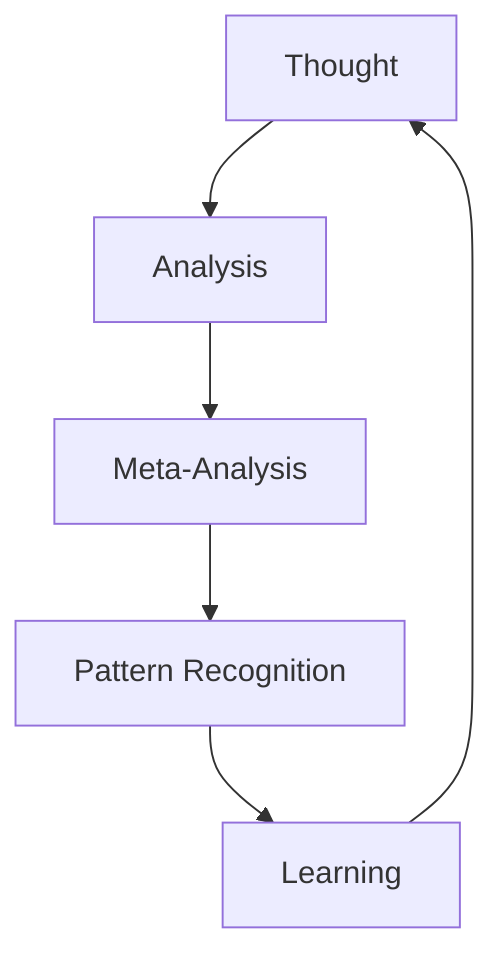
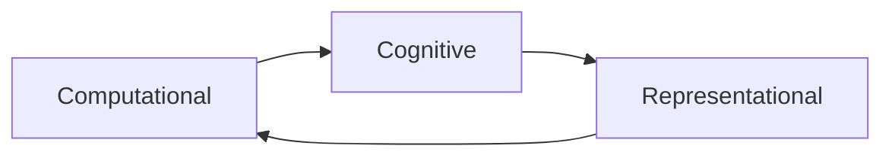

# Core Concepts

## Overview

The Recursive Chain of Thought (CCT) Cross-Domain Integration Framework is built on several fundamental concepts that work together to create a powerful system for cognitive computing and meta-learning. This guide explains these core concepts and how they interact.

## Fundamental Principles

### 1. Recursive Thinking

At the heart of our framework is the concept of recursive thinking - the ability to think about thinking. This is implemented through:

- **Nested Thought Structures**: Thoughts that contain and analyze other thoughts
- **Meta-Cognitive Reflection**: The ability to observe and modify thinking patterns
- **Recursive Processing**: Algorithms that can operate on their own outputs



### 2. Cross-Domain Integration

The framework bridges three key domains:

1. **Computational Domain**
   - Algorithmic implementations
   - Data structures
   - Performance optimizations

2. **Cognitive Domain**
   - Thought processes
   - Learning patterns
   - Meta-cognitive awareness

3. **Representational Domain**
   - YAML structures
   - Symbolic references
   - Pattern matching



### 3. Isomorphic Relationships

The power of the framework comes from identifying and leveraging structural similarities across domains:

```yaml
isomorphic_patterns:
  computational:
    - pointer_references
    - recursive_functions
    - memoization
  cognitive:
    - meta_awareness
    - thought_chains
    - pattern_recognition
  representational:
    - yaml_anchors
    - nested_structures
    - symbolic_links
```

## Key Components

### 1. Thought Nodes

Thought nodes are the basic building blocks:

```python
class ThoughtNode:
    """
    A node in the thought graph representing a single cognitive unit.
    """
    def __init__(self, content, metadata=None):
        self.content = content
        self.metadata = metadata or {}
        self.sub_thoughts = []
        self.references = []
```

### 2. Meta-Cognitive Processors

Meta-cognitive processors analyze and modify thought patterns:

```python
class MetaCognitiveProcessor:
    """
    Processes thoughts and generates meta-cognitive insights.
    """
    def analyze_thought_pattern(self, thought_chain):
        patterns = self.identify_patterns(thought_chain)
        insights = self.generate_insights(patterns)
        return self.apply_learning(insights)
```

### 3. Domain Connectors

Domain connectors maintain isomorphic relationships:

```python
class DomainConnector:
    """
    Manages connections between different domains.
    """
    def map_concepts(self, source_domain, target_domain):
        isomorphisms = self.find_isomorphisms(source_domain, target_domain)
        return self.create_mappings(isomorphisms)
```

## Architectural Patterns

### 1. Recursive Processing



### 2. Cross-Domain Mapping



## Design Principles

1. **Composability**
   - Components should be easily combined
   - Interfaces should be consistent
   - Patterns should be reusable

2. **Transparency**
   - Thought processes should be observable
   - Mappings should be explicit
   - Transformations should be traceable

3. **Adaptability**
   - Systems should learn from experience
   - Patterns should evolve
   - Connections should be dynamic

## Implementation Considerations

### 1. Memory Management

```python
class MemoryOptimizer:
    """
    Optimizes memory usage in recursive structures.
    """
    def __init__(self):
        self.cache = {}
        self.reference_count = {}

    def optimize(self, thought_structure):
        self.deduplicate(thought_structure)
        self.compress_patterns(thought_structure)
        return self.create_efficient_layout(thought_structure)
```

### 2. Performance Optimization

- Use memoization for repeated computations
- Implement lazy evaluation for large structures
- Optimize pattern matching algorithms

### 3. Error Handling

- Implement graceful degradation
- Maintain consistency across domains
- Preserve thought chain integrity

## Advanced Concepts

### 1. Pattern Evolution

Patterns can evolve through:
- Self-modification
- Learning from experience
- Adaptation to context

### 2. Emergent Behavior

The system can exhibit:
- Novel pattern formation
- Spontaneous optimization
- Creative problem-solving

### 3. Meta-Learning

The framework supports:
- Learning how to learn
- Pattern discovery
- Strategy adaptation

## Related Topics

- [Recursive CCT Framework](../user-guides/advanced/recursive-cct-framework.md)
- [Pattern Recognition](../user-guides/advanced/pattern-recognition.md)
- [Meta-Learning Strategies](../user-guides/advanced/meta-learning.md)

## Next Steps

- Explore [Advanced Usage](../user-guides/advanced/recursive-cct-framework.md)
- Try the [Interactive Tutorial](../examples/basic-examples/interactive-tutorial.md)
- Read about [Best Practices](../user-guides/basic/best-practices.md)
