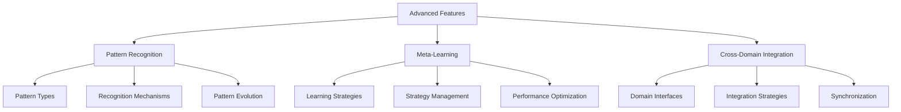

# Advanced User Guides

## Overview

The advanced guides cover sophisticated features and techniques of the CCT Framework. These guides are designed for users who are already familiar with the basic concepts and want to dive deeper into specific aspects of the framework.

## Guide Structure

## Core Advanced Topics

### [Pattern Recognition](pattern-recognition.md)
- Structural, temporal, and semantic pattern recognition
- Pattern learning and evolution
- Custom pattern recognition systems
- Visualization and monitoring

### [Meta-Learning Strategies](meta-learning.md)
- Strategy management and evolution
- Pattern-based and recursive learning
- Adaptive learning techniques
- Performance monitoring and optimization

### [Cross-Domain Integration](cross-domain-integration.md)
- Domain interfaces and mapping
- Integration strategies
- Multi-domain synchronization
- Transformation pipelines

## Topic Relationships

The advanced topics are deeply interconnected:

1. **Pattern Recognition ↔ Meta-Learning**
   - Pattern recognition provides input for meta-learning strategies
   - Meta-learning improves pattern recognition accuracy
   - Shared visualization and monitoring techniques

2. **Meta-Learning ↔ Cross-Domain Integration**
   - Meta-learning strategies adapt to different domains
   - Cross-domain integration enables knowledge transfer
   - Common optimization approaches

3. **Cross-Domain Integration ↔ Pattern Recognition**
   - Pattern recognition across domains
   - Integration patterns and recognition patterns
   - Shared transformation techniques

## Prerequisites

Before diving into these advanced topics, ensure you have:

1. Completed the [Getting Started](../../getting-started/quick-start.md) guide
2. Understanding of [Core Concepts](../../getting-started/core-concepts.md)
3. Experience with basic framework usage
4. Familiarity with Python and object-oriented programming

## Learning Path

Recommended sequence for advanced topics:

1. Start with **Pattern Recognition**
   - Fundamental patterns and recognition mechanisms
   - Basic pattern evolution
   - Visualization techniques

2. Progress to **Meta-Learning**
   - Building on pattern recognition concepts
   - Understanding learning strategies
   - Performance optimization

3. Conclude with **Cross-Domain Integration**
   - Applying patterns across domains
   - Implementing integration strategies
   - Advanced synchronization techniques

## Best Practices

Each advanced guide includes:
- Detailed code examples
- Best practices and optimization tips
- Troubleshooting guides
- Performance considerations

## Additional Resources

- [API Reference](../../api/README.md)
- [Example Projects](../../examples/README.md)
- [Performance Tuning Guide](performance-tuning.md)
- [Extension Development](extension-development.md)

## Contributing

Want to improve these guides? See our [Contributing Guide](../../meta/contribution-guide.md) for:
- Documentation standards
- Example guidelines
- Review process 