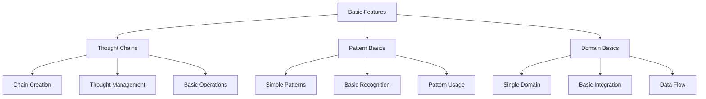

# Basic User Guides

## Overview

The basic guides provide foundational knowledge and practical implementations of the CCT Framework's core features. These guides bridge the gap between getting started and advanced topics, ensuring a smooth learning progression.

## Guide Structure



## Core Basic Topics

### [Working with Thought Chains](thought-chains.md)
- Creating and managing thought chains
- Basic thought operations
- Chain visualization
- Simple transformations

### [Basic Pattern Usage](basic-patterns.md)
- Understanding pattern types
- Simple pattern recognition
- Pattern application
- Basic visualization

### [Domain Fundamentals](domain-basics.md)
- Single domain operations
- Basic domain integration
- Data flow management
- Simple transformations

## Practical Examples

### 1. Simple Thought Chain

```python
from cct_framework import ThoughtChain

# Create a basic thought chain
chain = ThoughtChain("Problem Solving")

# Add thoughts
chain.add_thought("Problem Definition")
chain.add_thought("Solution Approach")
chain.add_thought("Implementation")

# Basic visualization
chain.visualize()
```

### 2. Basic Pattern Recognition

```python
from cct_framework.patterns import BasicRecognizer

# Create a pattern recognizer
recognizer = BasicRecognizer()

# Define a simple pattern
pattern = recognizer.create_pattern("sequential_steps")

# Apply pattern
matches = recognizer.find_matches(chain, pattern)
```

### 3. Simple Domain Operation

```python
from cct_framework.domains import BasicDomain

# Create a domain
domain = BasicDomain("computational")

# Add basic operations
domain.add_operation("transform")
domain.add_operation("analyze")

# Execute operation
result = domain.execute("transform", data)
```

## Learning Progression

### From Getting Started
- Building on installation and setup
- Expanding core concepts
- Practical implementation

### Toward Advanced Topics
- Introduction to pattern recognition
- Basics of meta-learning
- Simple cross-domain operations

## Best Practices

### Code Organization
- Clear structure
- Proper naming
- Error handling
- Documentation

### Performance
- Basic optimization
- Resource management
- Simple caching

### Testing
- Unit tests
- Integration tests
- Error scenarios

## Common Patterns

### 1. Chain Management
- Creation
- Modification
- Visualization
- Export/Import

### 2. Pattern Usage
- Definition
- Recognition
- Application
- Validation

### 3. Domain Operations
- Setup
- Execution
- Monitoring
- Error Handling

## Troubleshooting

### Common Issues
1. Chain Creation Problems
   - Check initialization parameters
   - Verify thought structure
   - Validate connections

2. Pattern Recognition Issues
   - Verify pattern definition
   - Check recognition parameters
   - Validate input data

3. Domain Operation Errors
   - Confirm domain setup
   - Check operation parameters
   - Verify data format

## Next Steps

After completing these basic guides, you'll be ready to:
1. Explore [Advanced Topics](../advanced/README.md)
2. Work with complex patterns
3. Implement cross-domain integration
4. Develop custom solutions

## Additional Resources

- [API Reference](../../api/README.md)
- [Example Projects](../../examples/README.md)
- [Community Forums](https://community.cct-framework.org)
- [Video Tutorials](https://learn.cct-framework.org)

## Getting Help

- [Documentation Issues](../../meta/contribution-guide.md#reporting-issues)
- [Community Support](https://community.cct-framework.org/support)
- [Stack Overflow Tag](https://stackoverflow.com/questions/tagged/cct-framework) 